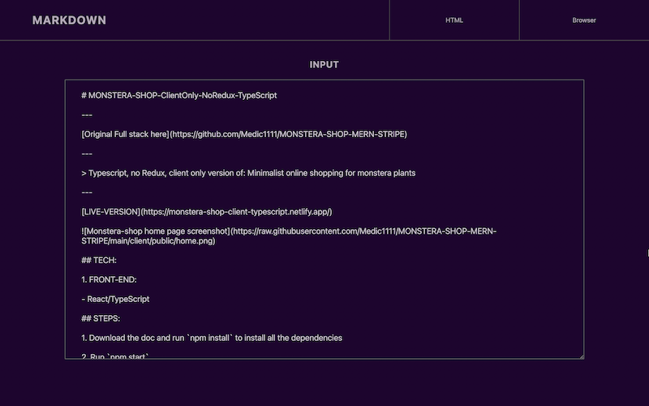
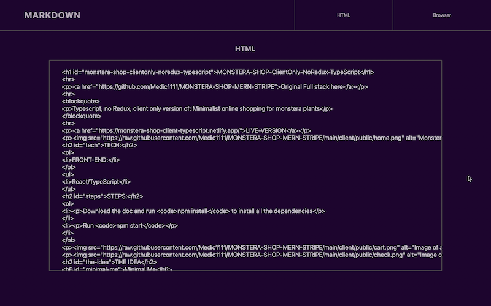
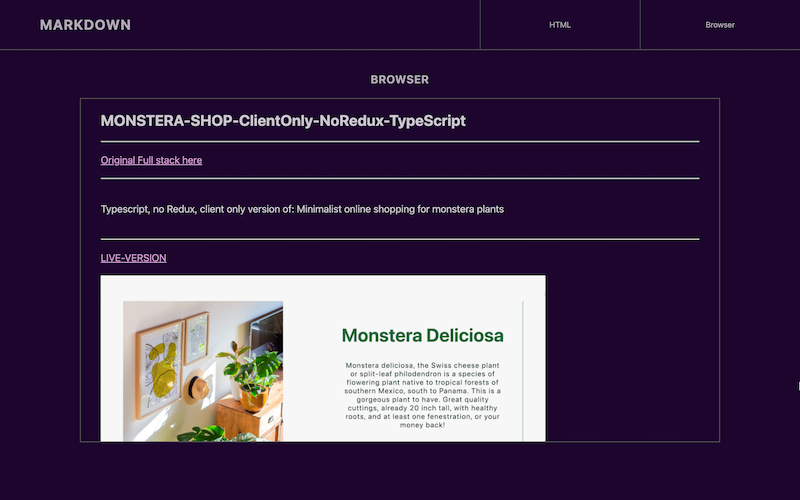

# MARKDOWN-PREVIEWER-React/TypeScript

---

[Live here](https://markdown-react-typescript.netlify.app/)

---

> Simple markdown previewer built with react/typescript. User may input markdown syntax and preview HTML version on browser and html syntax.

---

---

---

---
